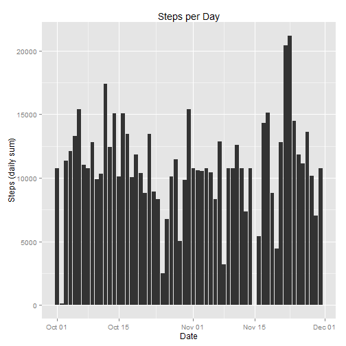
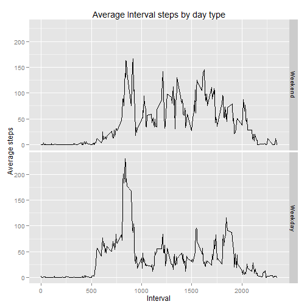

Reproducible Research: Peer Assessment 1
========================================


## Loading and preprocessing the data
The data used for this analysis are available here: <a href=https://d396qusza40orc.cloudfront.net/repdata%2Fdata%2Factivity.zip>Activity monitoring data</a>

First we must download, unzip, and load the data. Knitr cannot handle 
downloading well, so code to download is reproduced with results and warnings 
suppressed:


```r
## set WD on local machine to the location of this Rmd file; setup data dir
setwd("C:/Users/570815/Dropbox/Coursera/R Working Directory/RepData_PeerAssessment1")
zipURL <- "https://d396qusza40orc.cloudfront.net/repdata%2Fdata%2Factivity.zip"
if (!file.exists("./data")) {
    dir.create("./data")
}
```


To download on Windows [try() wrapper is to suppress superfluous Error message
produced when knitting]:


```r
try(download.file(zipURL, destfile = "./data/AMdata.zip"))
dateDownloaded <- date()
```


To download on Mac:


```r
download.file(zipURL, destfile = "./data/AMdata.zip", method = "curl")
dateDownloaded <- date()
```


After downloading is complete, extract the activity.csv file to the ./data
directory in the working directory, and load the data into R with appropriate 
column classes:


```r
unzip("./data/AMdata.zip", exdir = "./data")
classes <- c("integer", "Date", "factor")
am <- read.csv("./data/activity.csv", colClasses = classes)
```


The data are now loaded into R and can be used for subsequent analysis.

## What is mean total number of steps taken per day?

Here we can see an initial look at the data on number of steps taken per day, 
with missing values stripped from the data:


```r
library(ggplot2)
am2 <- am[complete.cases(am), ]
sumByDate <- aggregate(am2$steps, list(Date = am2$date), sum)
qplot(sumByDate$Date, sumByDate$x, geom = "bar", stat = "identity", main = "Total Steps per Day", 
    xlab = "Date", ylab = "Steps (daily sum)")
```

 


The data appear roughly bimodal, and some days have no activity recorded.  We
can also compute some summary statistics on a daily basis for total number of
steps taken:


```r
mean(sumByDate$x)
```

```
## [1] 10766
```

```r
median(sumByDate$x)
```

```
## [1] 10765
```


## What is the average daily activity pattern?

To look at average daily activity pattern, we can make a time series plot of the
interval and average number of steps taken in that interval (averaged across all
days for which data are available):


```r
avgSteps <- aggregate(am2$steps, list(Interval = as.numeric(as.character(am2$interval))), 
    mean)
qplot(avgSteps$Interval, avgSteps$x, geom = "line", stat = "identity", main = "Average Steps per Interval", 
    xlab = "Interval", ylab = "Steps (daily average)")
```

 


The daily interval with the maximum average across all days in the dataset can 
be obtained as follows:


```r
avgSteps[grep(max(avgSteps$x), avgSteps$x), ]
```

```
##     Interval     x
## 104      835 206.2
```


Therefore the interval of 835 has the highest daily average number of steps.

## Imputing missing values

There are a number of observations in the dataset with missing values. We can 
examine the degree to which this is the case, and use imputation to create an 
alternate dataset with "complete" cases for all observations.

First, we calculate the total number of observations with missing values:


```r
nrow(am) - nrow(am[complete.cases(am), ])
```

```
## [1] 2304
```


N.B. that this number is exactly divisible by 288 (the number of intervals per 
day) -- indicating that there are 8 days for which data was entirely unavailable. 
We can verify that this is the case as follows:


```r
levels(as.factor(am[is.na(am$steps), ]$date))
```

```
## [1] "2012-10-01" "2012-10-08" "2012-11-01" "2012-11-04" "2012-11-09"
## [6] "2012-11-10" "2012-11-14" "2012-11-30"
```


This will be of significance shortly.

Next, we impute missing values using a simplistic method that assigns the 
interval mean to each missing value.  This method assumes that daily interval 
activity will not be highly variable, which may not actually be the case, so a 
more sophisticated method could be devised. For the sake of convenience, however, 
we will make this simplifying assumption and fill in missing values in a new copy 
of the original data set:


```r
amImpute <- am
for (i in 1:nrow(amImpute)) {
    if (is.na(amImpute$steps[i])) {
        amImpute$steps[i] <- avgSteps$x[avgSteps$Interval == as.numeric(as.character(amImpute$interval[i]))]
    }
}
```


Finally, we can examine the data with missing values imputed:


```r
sumByDate2 <- aggregate(amImpute$steps, list(Date = amImpute$date), sum)
qplot(sumByDate2$Date, sumByDate2$x, geom = "bar", stat = "identity", main = "Steps per Day", 
    xlab = "Date", ylab = "Steps (daily sum)")
```

 


While this new histogram is less patchy than the original, there are still some 
gaps where data was recorded as zero for nearly every interval in a day, but not 
all -- this suggests that perhaps the recording device was either malfunctioning 
or not worn for most of the duration of those days, and a more robust imputation 
technique might discount those days and impute values for their intervals that 
were recorded as zero as well.

We can also examine the mean and median for the data set with imputed values:


```r
mean(sumByDate2$x)
```

```
## [1] 10766
```

```r
median(sumByDate2$x)
```

```
## [1] 10766
```


Note that there is essentially no difference in these values as compared to the 
initial computations: this is a direct result of the imputation method selected. 
As the missing values are for 8 complete days, the imputation method adds 8 
complete copies of an "average" day to the dataset. This has exactly no effect 
on the mean (as 8 copies of the daily mean are being added), and the median, 
which was coincidentally very close to the mean initially, has now been replaced 
by one of the copies of the mean value added via imputation.

Again, this suggests that a better imputation method could be devised, but your 
author is not sufficiently sophisticated to come up with one.

## Are there differences in activity patterns between weekdays and weekends?

We can examine the data set with imputed values in further detail to see if there 
are differences in average steps per interval between weekdays and weekends.

First, some processing in R to get the new dataset with interval averages and a 
new factor variable for weekday/weekend identification:


```r
## add weekday and weekend flag to data set with imputed values:
amImpute2 <- amImpute
amImpute2$weekday <- weekdays(amImpute$date)
amImpute2$weekend <- amImpute2$weekday %in% c("Saturday", "Sunday")

## work out interval averages by weekday/weekend:
avgSteps2 <- aggregate(amImpute2$steps, list(Interval = as.numeric(as.character(amImpute2$interval))), 
    mean)

avgWeekdaySteps <- aggregate(amImpute2[amImpute2$weekend == FALSE, ]$steps, 
    list(Interval = as.numeric(as.character(amImpute2[amImpute2$weekend == FALSE, 
        ]$interval))), mean)

avgWeekendSteps <- aggregate(amImpute2[amImpute2$weekend == TRUE, ]$steps, list(Interval = as.numeric(as.character(amImpute2[amImpute2$weekend == 
    TRUE, ]$interval))), mean)

## construct interval average dataset for faceted plot:
avgWeekdaySteps$daytype <- factor("Weekday")
avgWeekendSteps$daytype <- factor("Weekend")
splitAverageIntervals <- rbind(avgWeekendSteps, avgWeekdaySteps)
```


Now we can construct a panel plot with individual time series data for weekends 
versus weekday average steps per interval:


```r
qplot(data = splitAverageIntervals, Interval, x, facets = daytype ~ ., geom = "line", 
    main = "Average Interval steps by day type", ylab = "Average steps")
```

 


As can be seen here, there is a slight difference in trend; the weekend intervals 
in the middle of the day have a greater number of steps (perhaps due to less 
time being spent sitting at a workplace), and while both day types have a spike 
in the morning, weekdays appear to have a second spike in the evening whereas the 
data for weekends are generally choppier throughout the day.
