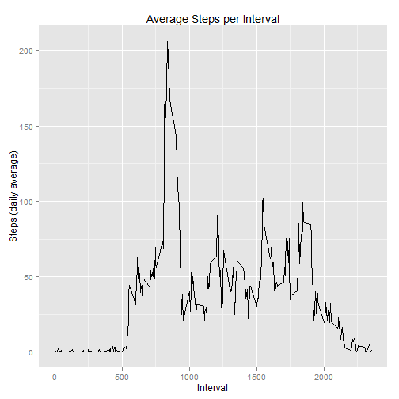

Reproducible Research: Peer Assessment 1
========================================


## Loading and preprocessing the data
The data used for this analysis are available here: <a href=https://d396qusza40orc.cloudfront.net/repdata%2Fdata%2Factivity.zip>Activity monitoring data</a>

First we must download, unzip, and load the data. Knitr cannot handle 
downloading well, so code to download is reproduced with results and warnings 
suppressed:


```r
## set WD on local machine to the location of this Rmd file; setup data dir
setwd("C:/Users/570815/Dropbox/Coursera/R Working Directory/RepData_PeerAssessment1")
zipURL <- "https://d396qusza40orc.cloudfront.net/repdata%2Fdata%2Factivity.zip"
if (!file.exists("./data")) {
    dir.create("./data")
}
```


To download on Windows [try() wrapper is to suppress superfluous Error message
produced when knitting]:


```r
try(download.file(zipURL, destfile = "./data/AMdata.zip"))
dateDownloaded <- date()
```


To download on Mac:


```r
download.file(zipURL, destfile = "./data/AMdata.zip", method = "curl")
dateDownloaded <- date()
```


After downloading is complete, extract the activity.csv file to the ./data
directory in the working directory, and load the data into R with appropriate 
column classes:


```r
unzip("./data/AMdata.zip", exdir = "./data")
classes <- c("integer", "Date", "factor")
am <- read.csv("./data/activity.csv", colClasses = classes)
```


The data are now loaded into R and can be used for subsequent analysis.

## What is mean total number of steps taken per day?

Here we can see an initial look at the data on number of steps taken per day, 
with missing values stripped from the data:


```r
library(ggplot2)
am2 <- am[complete.cases(am), ]
sumByDate <- aggregate(am2$steps, list(Date = am2$date), sum)
qplot(sumByDate$Date, sumByDate$x, geom = "bar", stat = "identity", main = "Steps per Day", 
    xlab = "Date", ylab = "Steps (daily sum)")
```

 


The data appear roughly bimodal, and some days have no activity recorded.  We
can also compute some summary statistics on a daily basis for total number of
steps taken:


```r
mean(sumByDate$x)
```

```
## [1] 10766
```

```r
median(sumByDate$x)
```

```
## [1] 10765
```


## What is the average daily activity pattern?

To look at average daily activity pattern, we can make a time series plot of the
interval and average number of steps taken in that interval (averaged across all
days for which data are available):


```r
avgSteps <- aggregate(am2$steps, list(Interval = as.numeric(as.character(am2$interval))), 
    mean)
qplot(avgSteps$Interval, avgSteps$x, geom = "line", stat = "identity", main = "Average Steps per Interval", 
    xlab = "Interval", ylab = "Steps (daily average)")
```

 


The daily interval with the maximum average across all days in the dataset can 
be obtained as follows:


```r
avgSteps[grep(max(avgSteps$x), avgSteps$x), ]
```

```
##     Interval     x
## 104      835 206.2
```


Therefore the interval of 835 has the highest daily average number of steps.

## Imputing missing values

There are a number of observations in the dataset with missing values. We can 
examine the degree to which this is the case, and use imputation to create an 
alternate dataset with "complete" cases for all observations.

First, we calculate the total number of observations with missing values:


```r
nrow(am) - nrow(am[complete.cases(am), ])
```

```
## [1] 2304
```


Next, we impute missing values using a simplistic method that assigns the 
interval mean to each missing value.  This method assumes that daily activity 
will be roughly cyclical, which may not actually be the case, so a more 
sophisticated method could be devised. For the sake of convenience, however, we 
will make this simplifying assumption and fill in missing values in a new copy 
of the original data set:


```r
amImpute <- am
for (i in 1:nrow(amImpute)) {
    if (is.na(amImpute$steps[i])) {
        amImpute$steps[i] <- avgSteps$x[avgSteps$Interval == as.numeric(as.character(amImpute$interval[i]))]
    }
}
```


Finally, we can examine the data with missing values imputed:


```r
sumByDate2 <- aggregate(amImpute$steps, list(Date = amImpute$date), sum)
qplot(sumByDate2$Date, sumByDate2$x, geom = "bar", stat = "identity", main = "Steps per Day", 
    xlab = "Date", ylab = "Steps (daily sum)")
```

 


While this new histogram is less patchy than the original, there are still some 
gaps, where data was missing for a given interval that happened to be zero or 
near zero on average, illustrating a shortcoming of the imputation technique 
used.

We can also examine the mean and median for the data set with imputed values:


```r
mean(sumByDate2$x)
```

```
## [1] 10766
```

```r
median(sumByDate2$x)
```

```
## [1] 10766
```


<div style="color:red">There appears to be no significant difference from the initial histogram, indicating that I have screwed up somewhere....</div>

## Are there differences in activity patterns between weekdays and weekends?


